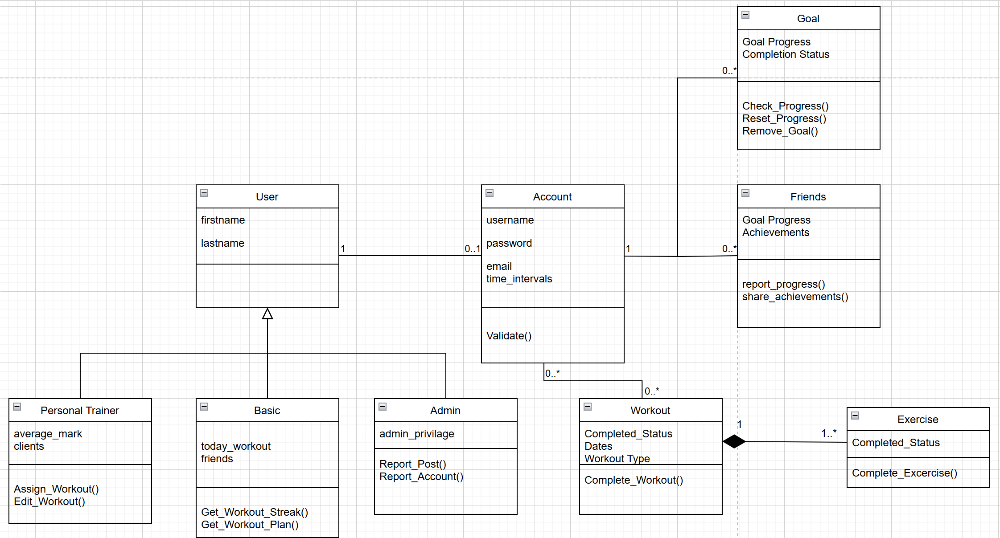

### System Description

Fitness planning can be challenging for many **User**s, leading to irregular and unproductive **Workout** sessions that hinder progress. For internet users who struggle with fitness planning, our website provides a free solution that centralizes and automates all functions of creating effective workout plans with diverse **Exercise**s. Our value proposition is to empower fitness newcomers by offering a comprehensive platform that guides them in setting and achieving **Goal**s, building confidence and independence along the way.

Key requirements of our system include an **Account**s module ensuring that only authorized **User**s can ***access*** their accounts using a correct *password*. **User**s ***register*** by supplying a unique *username* and *email*, and then ***log in*** to manage their personalized **Workout**. A **Workout** ***contains*** several **Exercise**s. **User**s can ***schedule*** and ***update*** daily **Workout**s, within their **Account** which ***monitors*** completion rates and ***calculates*** streaks over various *time intervals* (such as *daily* or *weekly*). Furthermore, the **Goal** system ***analyzes*** past **Workout** data and ***suggests*** new routines based on specific *Workout Tag*s that ***classify*** exercises by attributes like *name*, *duration*, *muscle groups*, and *intensity*. 
Beyond individual progress, the system encourages the community aspect of our website by enabling **User**s to ***connect*** with **Friends**, share achievements, and mutually ***support*** one another. **Personal Trainer**s are a type of **User** that are able to ***add*** other **User**s as clients, where they then can ***create*** **Workout**s for **User**s. **Personal Trainers** can also leverage the platform to ***monitor*** multiple **User** profiles, ensuring personalized guidance for each client. Designed for both desktop and mobile use, the system emphasizes portability, usability, and minimal downtime to provide a seamless, fitness experience.

### Model

